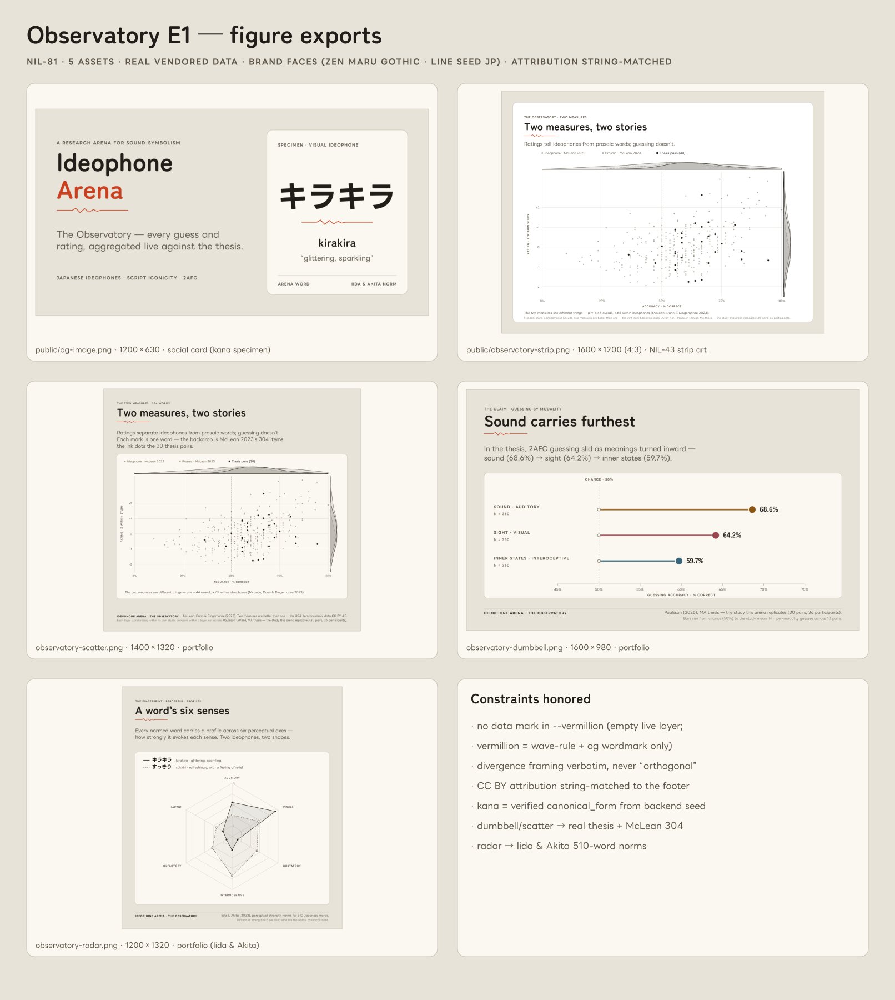

# Observatory figure exports (NIL-81 · E1)

Poster-grade **static** exports of the committed Observatory v1.0 (`ab04469`),
the E1 stage of the SPEC-stats-dashboard export ladder. These are the "outside
the interactive SVG pipeline" deliverables: social card, landing strip art, and
portfolio figures for the NIL-44 README.



## What ships where

| Asset | Size | Home | Consumer |
| --- | --- | --- | --- |
| `og-image.png` | 1200×630 | `public/` | Social card / `<meta>` (NIL-43 wires the tags) |
| `observatory-strip.png` | 1600×1200 (4:3) | `public/` | NIL-43 Observatory strip, art-left slot (V16) |
| `observatory-scatter.png` | 1400×1320 | here | NIL-44 README portfolio — "the two measures" |
| `observatory-dumbbell.png` | 1600×980 | here | NIL-44 README portfolio — "the claim" |
| `observatory-radar.png` | 1200×1320 | here | NIL-44 README portfolio — "the fingerprint" |
| `contact-sheet.png` | — | here | This index |

SVG sources live in `svg/`; PNGs are `rsvg-convert`ed from them 1:1. The full set
is also mirrored to the planning folder `docs/design/observatory-exports/` (per
NIL-81's exit line); the web-repo copies here are the working ones the README and
landing consume.

## Provenance & honesty

- **Real data only.** Every mark is read from the vendored Observatory datasets
  (`src/data/observatory/*.json`) — the same files the live panels read. Nothing
  is invented. Dumbbell = thesis modality means (68.6 → 64.2 → 59.7%); scatter =
  McLean 2023's 304 items + the 30 thesis pairs; radar = Iida & Akita's 510-word
  perceptual-strength norms (kirakira vs sukkiri, the panel's default pair).
- **Verified kana only.** The kana on the og specimen (キラキラ) and the radar
  chips (キラキラ / すっきり) are the words' `canonical_form` lifted **verbatim
  from the backend seed** (`ideophone-arena-api` → `db/init/ideophone_arena.sql`).
  Script choice (hiragana vs katakana) is the thesis's own variable, so kana is
  never romaji→kana-guessed — invariant 1. If you add specimens, pull the form
  from the seed (or `displayForm`), don't transliterate.
- **No live arena layer.** A static export has no live record, so **no arena
  data is plotted** — which is why no data mark is vermillion. Per UI-SYSTEM
  §4.1, `--vermillion` is arena-data-only; here it appears solely as the §10.6
  seismograph wave-rule identity motif (and, on the social card, the wordmark
  accent — brand identity, not a data mark).
- **Divergence framing.** The scatter carries the sanctioned line verbatim —
  "the two measures see different things", never "orthogonal".
- **Attribution (CC BY).** Every figure bakes its layer's credit, string-matched
  to the Observatory footer (`src/observatory/Observatory.tsx`): McLean "data CC
  BY 4.0" (scatter), Paulsson thesis (dumbbell + scatter), Iida & Akita 510-word
  norms (radar). Do not paraphrase — they must keep matching the footer (V17).

## Strip-art crop (D5)

D5 asks which export fills landing strip 6, and its crop. Delivered primary:
**the scatter**, recomposed landscape at 4:3 (`observatory-strip.png`) — it is
the signature "two measures" figure and the densest at this ratio. The
**dumbbell** portfolio figure is the ready alternative if Nils's eye prefers the
cleaner claim; it is already 4:3-friendly and can be dropped in with a title
tweak. Either lifts the V16 binding fallback.

## Regenerating

```sh
# 1. emit the SVG sources from live data
node docs/design/observatory-figures/generate-figures.mjs docs/design/observatory-figures/svg
# 2. rasterize to the shipped PNGs
rsvg-convert docs/design/observatory-figures/svg/og-image.svg          -o public/og-image.png
rsvg-convert docs/design/observatory-figures/svg/observatory-strip.svg -o public/observatory-strip.png
rsvg-convert docs/design/observatory-figures/svg/observatory-dumbbell.svg -o docs/design/observatory-figures/observatory-dumbbell.png
rsvg-convert docs/design/observatory-figures/svg/observatory-scatter.svg  -o docs/design/observatory-figures/observatory-scatter.png
rsvg-convert docs/design/observatory-figures/svg/observatory-radar.svg    -o docs/design/observatory-figures/observatory-radar.png
```

## Fonts

Rendered in the **brand faces** per `tokens.css`: **Zen Maru Gothic** (display /
headings / big values) + **LINE Seed JP** (body copy, specimen labels, axis
ticks — uppercased and tracked for labels, exactly as the shipped Observatory
panels do). `rsvg`/fontconfig has no CJK-brand faces by default, so they are
installed from the vendored `@fontsource` **WOFF1** subsets, converted to TTF:

```sh
# woff2sfn ships as /usr/bin/woff2sfn (AUR woff-tools). latin + greek subsets,
# weights 400/700, both families, into ~/.fonts then fc-cache -f.
# line-seed-jp `japanese` subset supplies the kana (og specimen + radar chips).
for f in node_modules/@fontsource/zen-maru-gothic/files/zen-maru-gothic-{latin,greek}-{400,700}-normal.woff \
         node_modules/@fontsource/line-seed-jp/files/line-seed-jp-{latin,latin-ext,greek-ext,japanese}-{400,700}-normal.woff; do
  woff2sfn "$f" > ~/.fonts/ideophone-arena/"$(basename "${f%.woff}").ttf"
done; fc-cache -f ~/.fonts/ideophone-arena
```

A few non-Latin symbols (→ ≈) live in no brand subset and fall back to Noto —
cosmetically negligible on the one caption that uses them. Re-render on a host
without these faces installed and the figures degrade gracefully to the system
sans; install them for the 1:1 brand pass.

## og:image `<meta>` (for whoever wires NIL-43 landing/meta — not applied here)

```html
<meta property="og:image" content="/og-image.png" />
<meta property="og:image:width" content="1200" />
<meta property="og:image:height" content="630" />
<meta name="twitter:card" content="summary_large_image" />
```
